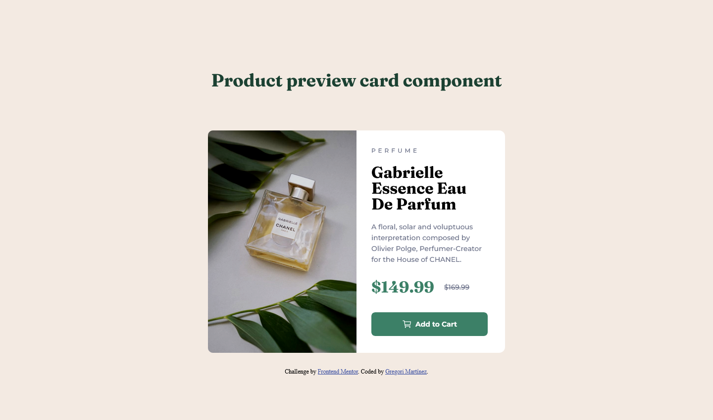

# Frontend Mentor - Product preview card component solution

This is a solution to the [Product preview card component challenge on Frontend Mentor](https://www.frontendmentor.io/challenges/product-preview-card-component-GO7UmttRfa). Frontend Mentor challenges help you improve your coding skills by building realistic projects. 


## Table of contents

- [Overview](#overview)
  - [The challenge](#the-challenge)
  - [Screenshot](#screenshot)
  - [Links](#links)
- [My process](#my-process)
  - [Built with](#built-with)
  - [What I learned](#what-i-learned)
  - [Continued development](#continued-development)
  - [Useful resources](#useful-resources)
- [Author](#author)


## Overview

### The challenge

Users should be able to:

- View the optimal layout depending on their device's screen size
- See hover and focus states for interactive elements

### Screenshot



### Links

- Live Site URL: [Click me](https://gregorim04.github.io/product-preview-card-component-main/)
- Github URL: [Click me](https://github.com/GregoriM04/product-preview-card-component-main.git)


## My process

### Built with

- Semantic HTML5 markup
- CSS custom properties
- Flexbox
- Desktop-first workflow

### What I learned

With this challenge, I was able to reinforce many concepts and learn a few more properties, and also certain behaviors of other ones.

I have here a property I wish I knew when I started:

```css
.item-img .desktop-img {
    filter:saturate(103%) contrast(115%) brightness(86%);
}
```

I wish I knew that when I started because sometimes I had a specific image on my mind, so I used to use Photoshop to make images darker or to get a little bit of extra saturation. But now I know I can get the image the way I want just coding a little bit :)

### Continued development

I just need to keep myself practicing, even if It's just one or two hours per week. With consistency and time, I'll get it.

### Useful resources

- [Geeksforgeeks](https://www.geeksforgeeks.org/how-to-darken-an-image-using-css/) - This helped me to understand the best way to manipulate an image with CSS.


## Author

- LinkedIn - [Gregori Martinez](https://www.linkedin.com/in/gregorim04/)
- Frontend Mentor - [@GregoriM04](https://www.frontendmentor.io/profile/GregoriM04)
- Twitter - [@GregoriM04](https://twitter.com/GregoriM04)
